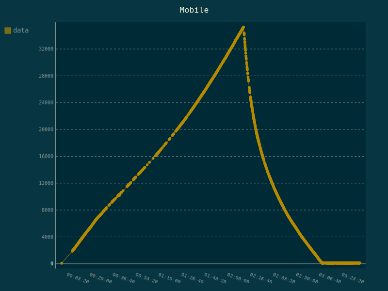
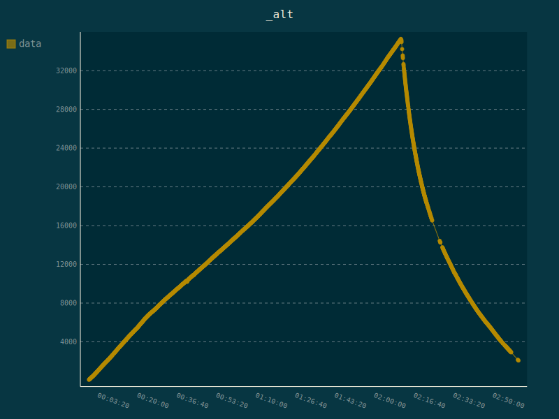

# HABDEC - RTTY decoder for High Altitude Balloons


Habdec is a C++11 software to decode RTTY telemetry from High Altitude Balloon and upload it to [UKHAS Habitat](http://habitat.habhub.org/)

Some facts:
- builds and runs on Windows/Linux and x64/RaspberryPI/OdroixXU4 platforms
- Uses [SoapySDR](https://github.com/pothosware/SoapySDR) to consume IQ stream from your SDR
- runs in command line (headless)
- provides websocket server so can be controlled from any web browser [even on your phone](https://www.youtube.com/watch?v=dli8FEFy5tM)
- can be easily integrated into your own code
- has example python client
- decodes [SSDV](https://ukhas.org.uk/guides:ssdv) images

Original motivation for habdec was to have a portable tracking device you could take to a chasecar or into a field.
Fatty laptop with dl-fldigi, full-fledged SDR app and required internet connection is not too comfortable.

Ultimatelly habdec is intended for integration into bigger app, based on OpenStreetmap and running on portable RaspberryPI or OdroidXU4 - see [here](https://www.youtube.com/watch?v=ZuoNf171e_A), [here](https://twitter.com/froszu/status/1274308780923269120) or [here](https://twitter.com/froszu/status/1271166163993661440)

It was successfully used to track and recover several HAB payloads.
Below is an altitude graph from ARY5 flight - you can see amount of valid telemetry sentences received. One receiver was a stationary antenna, the other is car roof magmount.




## Getting habdec

To get habdec you can download precompiled exec or build it from source.

#### Getting Binary:
- Install SoapySDR binaries from [here](https://github.com/pothosware/SoapySDR/wiki#installation)
- Download habdec executable for your platform from [here](https://github.com/ogre/habdec/wiki)

There's also raspberryPi 3 image with ready to use binary and build env. Go to [Wiki](https://github.com/ogre/habdec/wiki)

#### Building from source:
To build habdec you need a C++11 compiler and CMake version 3.8.2
You also need to build or install some dependencies:
- basic decoder: [FFTW](http://www.fftw.org/)
- websocket server: [SoapySDR](https://github.com/pothosware/SoapySDR), [boost 1.68](https://www.boost.org/) (any version with boost-beast)

Instructions how to build habdec and it's dependencies are described in [BuildInstructions.md](./BuildInstructions.md)

## Usage

`habdecWebsocketServer.exe --help`
```
Command Line Interface options:
  --config arg              Last run config file. Autosaved on every
                            successful decode.

CLI opts:
  --help                    Display help message
  --device arg              SDR Device Number. -1 to list
  --sampling_rate arg (=0)  Sampling Rate, as supported by device
  --no_exit arg             Constantly retry on missing device instead of exit.
  --port arg                Command Port, example: --port 127.0.0.1:5555
  --station arg             HABHUB station callsign
  --latlon arg              station GPS location (decimal)
  --alt arg                 station altitude in meters
  --freq arg                frequency in MHz
  --ppm arg                 frequency correction in PPM
  --gain arg                gain
  --print arg               live print received chars, values: 0, 1
  --rtty arg                rtty: baud bits stops, example: --rtty 300 8 2
  --biast arg               biasT, values: 0, 1
  --bias_t arg              biasT, values: 0, 1
  --afc arg                 Auto Frequency Correction, values: 0, 1
  --usb_pack arg            AirSpy USB bit packing
  --dc_remove arg           DC remove
  --dec arg                 decimation: 2^dec, range: 0-8
  --lowpass arg             lowpass bandwidth in Hertz
  --lp_trans arg            lowpass transition width. (0-1)
  --sentence_cmd arg        Call external command with sentence as parameter
  --flights [=arg(=0)]      List Habitat flights
  --payload arg             Configure for Payload ID
```

### Examples:
Print available devices

```
habdecWebsocketServer.exe --device -1


Reading config from file ./habdecWebsocketServer.opts
Current options:
        device: -1
        sampling_rate: 2.048e+06
        command_host: 0.0.0.0
        command_port: 5,555
        station: habdec
        freq: 4.3435e+08
        gain: 15
        live_print: 1
        baud: 300
        rtty_ascii_bits: 8
        rtty_ascii_stops: 2
        biast: 0
Found Rafael Micro R820T tuner
[INFO] [UHD] Win32; Microsoft Visual C++ version 14.0; Boost_106700; UHD_3.13.0.2-1-g78745bda

Available devices:
0:
        device_id 0
        driver airspy
        label AIRSPY [440464c8:39627b4f]
        serial 440464c8:39627b4f
        Sampling Rates:
                2.5e+06
                1e+07

1:
        available Yes
        driver rtlsdr
        label Generic RTL2832U OEM :: 00000001
        manufacturer Realtek
        product RTL2838UHIDIR
        rtl 0
        serial 00000001
        tuner Rafael Micro R820T
Found Rafael Micro R820T tuner
        Sampling Rates:
                250,000
                1.024e+06
                1.536e+06
                1.792e+06
                1.92e+06
                2.048e+06
                2.16e+06
                2.56e+06
                2.88e+06
                3.2e+06


No SDR device specified. Select one by specifying it's NUMBER
Failed Device Setup. EXIT.

```

Run with AirSpy

    habdecWebsocketServer.exe --device 0 --sampling_rate 2.5e6

Specify websocket address and port

    habdecWebsocketServer.exe --device 0 --sampling_rate 2.5e6 -port 12.13.14.15:5555

Some more options
```
habdecWebsocketServer.exe   --device 0 --sampling_rate 2.5e6
                            --port 12.13.14.15:5555 --station Fred
                            --rtty 300 8 2
                            --print 1
                            --freq 434.5 --gain 20 --biast 1 --afc 1
```

Load configuration for specific Habitat Payload
```
./habdecWebsocketServer --flights
Habitat Flights:
Flight: Belice-3 6d8281c7b6e54c0c9f2488c77d043f8a
	lat/lon: 49.7665 14.4731
Payload: DNA-3 289b03bf7a92e06cff8ab4fec1f789bd
	RS41-1 Belice 10/11/2018 St. Martin's day
	Flight ID: 6d8281c7b6e54c0c9f2488c77d043f8a
	freq 434,250,000
	baud/ascii/stops 50 7 2

./habdecWebsocketServer --payload 289b03bf7a92e06cff8ab4fec1f789bd
Loading parameters for payload 289b03bf7a92e06cff8ab4fec1f789bd
	baud: 50
	ascii_bits: 7
	ascii_stops: 2
	frequency: 434,250,000
```


### Web Client

To control habdec parameters from your browser:
- start browser
- open `habitat/code/webClient/index.html` file from disk
- set server field ip:port and Connect

Do not try connecting directly to `http://ip:port ` - habdec is not an HTTP server and you will see this error:

`The WebSocket handshake Connection field is missing the upgrade token`


## Known Limitations

- RTTY Modes **NOT** supported: 5bit baudot, 1.5 bit stop
- Decoding will stop if decimation setting is too low or too high. It was tested to work with stream around 40kHz bandwidth.
- Automatic Frequency Correction needs more work. Use consciously. dc_remove=on can help if AFC is confused by center spike.
- Connecting from browser is not very reliable yet, sometimes you need to refresh and wait.
- habdec was developed and tested with [AirSpy](https://airspy.com/) and [OdroidXU4](http://hardkernel.com/),[RaspberryPI](http://raspberrypi.org). Support for windows and RtlSdr is less tested.


## Reporting Problems

Use bugtracker, please.

## Contributions

Gladly accepted :)

## Authors

* **Michał Frątczak** - *parts of code from* - [GQRX](https://github.com/csete/gqrx)

## License

This project is licensed under the GNU General Public License
