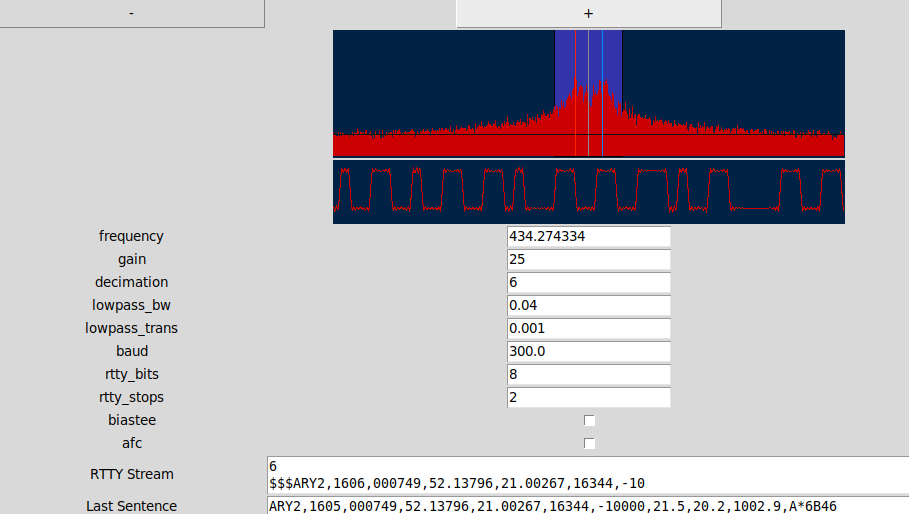

# Example python client for habdec websocket server

This is simple example of python client demonstrating how to connect to habdec server. The code is kept (almost) to minimum and is not meant for anything serious - just a proof of concept.

You need `pip install ws4py` and numpy.

GUI is done with tkinter (which you should have with python). Use something better for real work.
